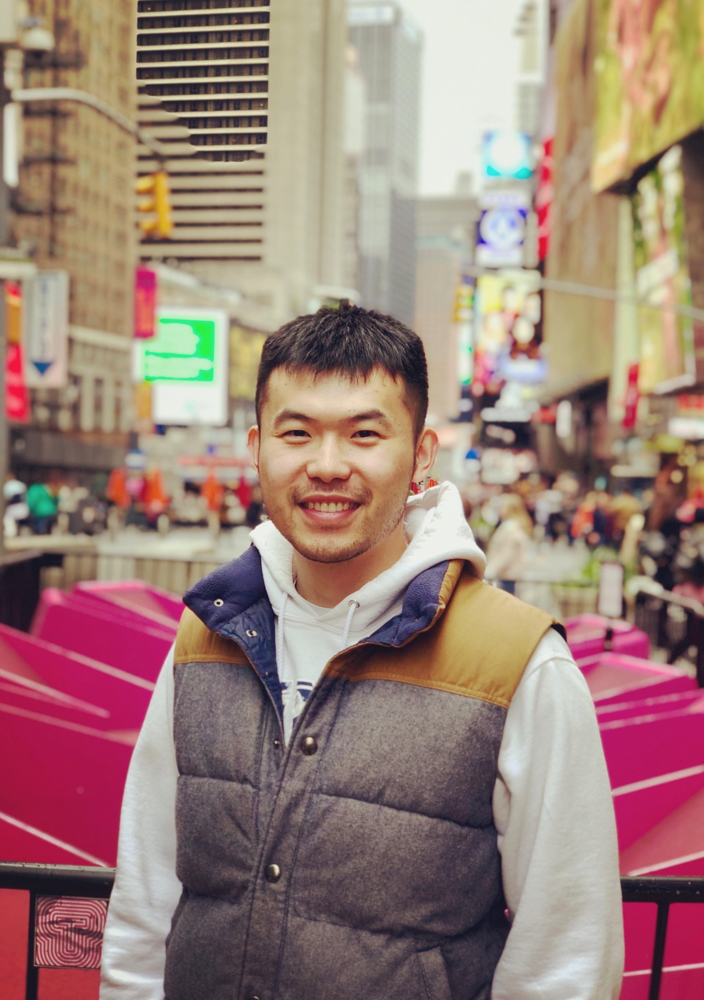

---
# Feel free to add content and custom Front Matter to this file.
# To modify the layout, see https://jekyllrb.com/docs/themes/#overriding-theme-defaults

layout: home
---

I am a graduate student in astronomy and astrophysics department with 5+ years astronomy data analysis experience. I am looking to obtain a Data Scientist internship, to utilize machine learning and computer vision to solve real-world problems.
